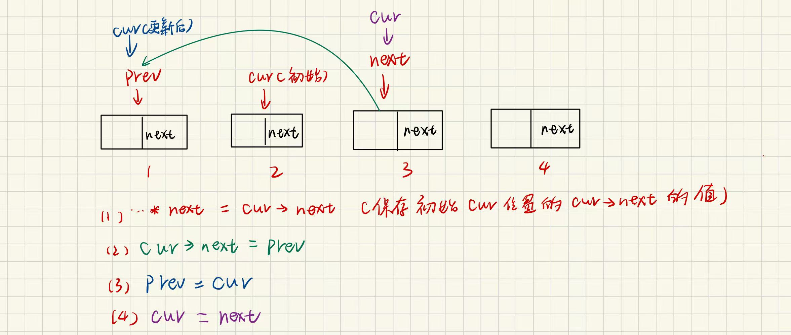

给你单链表的头节点 `head` ，请你反转链表，并返回反转后的链表。

**示例 1：**


```C++
输入：head = [1,2,3,4,5]
输出：[5,4,3,2,1]
```

**示例 2：**


```C++
输入：head = [1,2]
输出：[2,1]
```

**示例 3：**

```C++
输入：head = []
输出：[]
```

```C++
/**
 * Definition for singly-linked list.
 * struct ListNode {
 *     int val;
 *     ListNode *next;
 *     ListNode() : val(0), next(nullptr) {}
 *     ListNode(int x) : val(x), next(nullptr) {}
 *     ListNode(int x, ListNode *next) : val(x), next(next) {}
 * };
 */
class Solution {
public:
    ListNode* reverseList(ListNode* head) 
    {
        struct ListNode * cur = head;
        struct ListNode *newhead = NULL;
        while(cur)
        {
          struct ListNode *next = cur->next;//保存下一个节点，这个操作只有头插需要
          cur->next = newhead;//将该节点指向新链表的表头
          newhead = cur;//更新链表表头为当前节点
          cur = next;//根据逻辑关系找当前cur的下一位这里也等价cur=cur->next，但不能真这么写
        }
        return newhead;
    }
};
```




上图详细记录了指针cur的位置变化