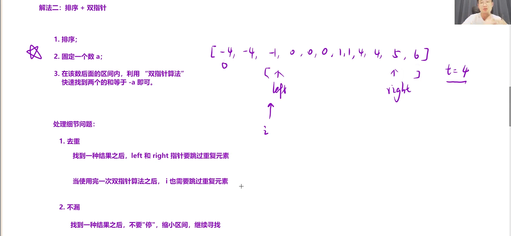

将两个升序链表合并为一个新的 **升序** 链表并返回。新链表是通过拼接给定的两个链表的所有节点组成的。

**示例 1：**


归并思路：两个有序数组归并，两个有序链表归并，思路都是类似的，依次⽐较取⼩的尾插到新数

组或者链表。不同的是两个链表可以把结点取下来插⼊到新链表，数组只能拷⻉数据到新数组。

•本题⽬归并时，可以需要不断取⼩的结点尾插到新链表，我们写了两个版本，⼀个不带哨兵位头结

点的版本，⼀个带哨兵位头结点的版本，⼤家对⽐下⾯的代码实现可以看到不带哨兵位的版本插⼊

时要⿇烦⼀下，插⼊第⼀个结点需要判断单独处理让头指针指向第⼀个结点，这⾥就可以很好理解

哨兵位的价值。

```C++
/**
 * Definition for singly-linked list.
 * struct ListNode {
 *     int val;
 *     ListNode *next;
 *     ListNode() : val(0), next(nullptr) {}
 *     ListNode(int x) : val(x), next(nullptr) {}
 *     ListNode(int x, ListNode *next) : val(x), next(next) {}
 * };
 */
class Solution {
public:
    ListNode* mergeTwoLists(ListNode* list1, ListNode* list2) {
        struct ListNode *head = NULL, *tail = NULL;
        if (!list1)
            return list2;
        if (!list2)
            return list1;
        while (list1 && list2) {
            if (list1->val < list2->val) {
                if (tail == NULL) {
                    head = tail = list1;
                } else {
                    tail->next = list1;
                    tail = tail->next;
                }
                list1 = list1->next;
            } else {
                if (tail == NULL) {
                    head = tail = list2;
                } else {
                    tail->next = list2;
                    tail = tail->next;
                }
                list2 = list2->next;
            }
        }
        if (list1)
            tail->next = list1;
        if (list2)
            tail->next = list2;
        return head;
    }
};

```

```C++
/**
 * Definition for singly-linked list.
 * struct ListNode {
 *     int val;
 *     ListNode *next;
 *     ListNode() : val(0), next(nullptr) {}
 *     ListNode(int x) : val(x), next(nullptr) {}
 *     ListNode(int x, ListNode *next) : val(x), next(next) {}
 * };
 */
class Solution {
public:
    ListNode* mergeTwoLists(ListNode* list1, ListNode* list2) {
        if (!list1)
            return list2;
        if (!list2)
            return list1;
        struct ListNode *head = NULL, *tail = NULL;
        head = tail = (struct ListNode*)malloc(sizeof(struct ListNode));
        while (list1 && list2) {
            if (list1->val < list2->val) {
                tail->next = list1;
                tail = tail->next;
                list1 = list1->next;
            } else {
                tail->next = list2;
                tail = tail->next;
                list2 = list2->next;
            }
        }
        if (list1)
            tail->next = list1;
        if (list2)
            tail->next = list2;
        struct ListNode* del = head;
        head = head->next;
        free(del);
        return head;
    }
};
```



不带哨兵位的情况，*head和*tail没有next，无法直接与第一个元素链接，所以应该用第一个元素的next链接head或tail