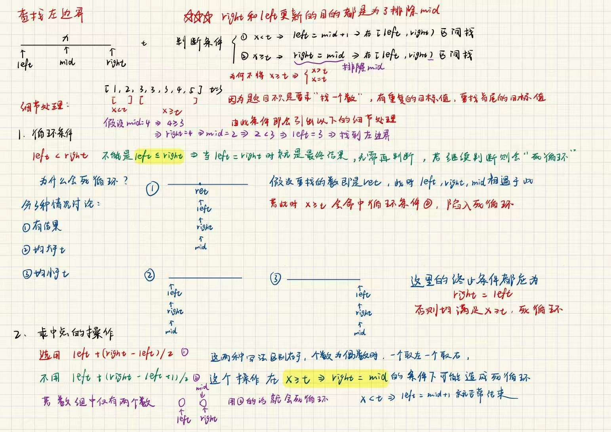
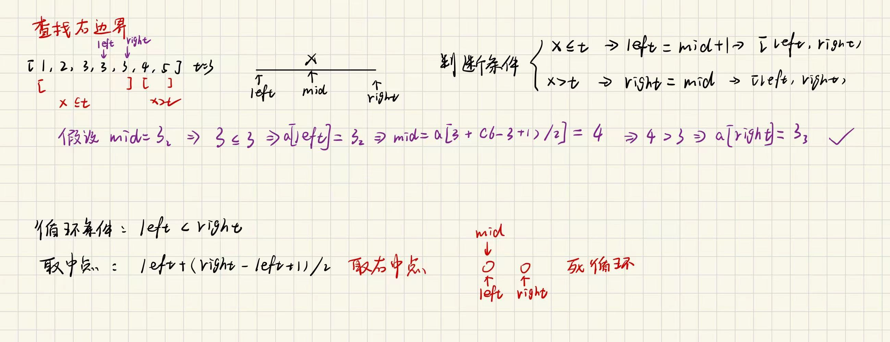

## 左边界查找：



## 右边界查找：



### 二分查找决策流程

1. **比较 `nums[mid]` 和 `target`**

  - 如果 `nums[mid] < target`：`mid` 不可能是答案，排除 `mid` 及左边 → `left = mid + 1`

  - 如果 `nums[mid] > target`：`mid` 不可能是答案，排除 `mid` 及右边 → `right = mid - 1`

  - 如果 `nums[mid] == target`：`mid` 可能是答案，**保留 `mid`**，继续往左或往右找

以[34. 在排序数组中查找元素的第一个和最后一个位置](https://leetcode.cn/problems/find-first-and-last-position-of-element-in-sorted-array/)为例子

```C++
class Solution {
public:
    vector<int> searchRange(vector<int>& nums, int target) 
    {
        int right1 = nums.size()-1;
        int right2 = nums.size()-1;
        int left1 = 0;
        int left2 = 0;
        vector<int> res;
        if(nums.empty())
        return {-1,-1};
        while(left1<right1)//查找左边界
        {
            int mid1 = left1 + (right1 - left1)/2;
            if(nums[mid1] >= target)
            right1 = mid1;
            else
            left1 = mid1 + 1;
        }
        if (left1 == nums.size() || nums[left1] != target) 
        {
            return {-1, -1};
        }
        res.push_back(left1);
        while(left2<right2)//查找右边界
        {
            int mid2 = left2 + (right2 - left2 + 1)/2;
            if(nums[mid2] <= target)
            left2 = mid2;
            else
            right2 = mid2 - 1;
        }
        res.push_back(left2);
        return res;
    }
};
```


### 查找左边界与查找右边界的"配套方案"

查找左边界：取左中点→right=mid，这样保证不会死循环

查找右边界：取右中点→left=mid，保证不会死循环

当然左右中点随意切换，只需要确保不死循环即可

### 快速套模板技巧

先写出≥或者≤的，若≥则说明要去左边找，此时挪动的是right，直接让right = mid，与左中点配套再写left = mid+1**排除mid**，若是≤的则要去右边找，挪动的是left，直接让left = mid，与右中点配套，再写right = mid-1**排除mid**

#### 更新right和left本质就是为了**排除（mid不可能直接命中target）/容纳（mid可能直接命中target）mid**

---

### 结合上述推导三个模板

#### 模板一：朴素查找（找确切值）

```C++
int search(vector<int>& nums, int target) {
    int left = 0, right = nums.size();   // 左闭右开 [left, right)
    
    while (left < right) {               //  left = right 时停止
        int mid = left + (right - left) / 2;  //  偏左，防止死循环
        
        if (nums[mid] == target) {
            return mid;
        } else if (nums[mid] < target) {
            left = mid + 1;              //  排除 mid，新区间 [mid+1, right)
        } else {
            right = mid;                 //  保留 mid 在左区间，新区间 [left, mid)
        }
    }
    return -1;
}
```


---

#### 模板二：查找左边界（第一个 >= target 的位置）

```C++
int leftBound(vector<int>& nums, int target) {
    int left = 0, right = nums.size();   // 左闭右开 [left, right)
    
    while (left < right) {               //  left = right 时停止
        int mid = left + (right - left) / 2;  //  左中点
        
        if (nums[mid] >= target) {
                   right = mid;  //去左边找，左中点与right = mid配套   
        } else {
                    left = mid + 1;  //去右边找
        }
    }
    return nums[left] == target ? left : -1;
}
```


---

#### 模板三：查找右边界（最后一个 <= target 的位置）

```C++
int rightBound(vector<int>& nums, int target) {
    int left = 0, right = nums.size()-1;

    while (left < right) {
        int mid = left + (right - left + 1) / 2;  // 右中点
        if (nums[mid] <= target) {
            left = mid;       //  去右边找，右中点与left = mid配套
        } else {
            right = mid - 1;  // 排除 mid
        }
    }
    return nums[left] == target ? left : -1;
}
```
这里left和right的更新标准，以及mid的更新位置本质都是为了不断调位，让right=left。
