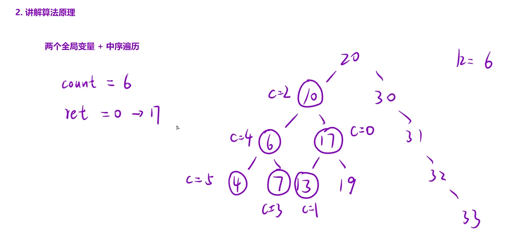

给定一个二叉搜索树的根节点 `root`，和一个整数 `k`，请你设计一个算法查找其中第 `k` 小的元素（`k` 从 1 开始计数）。

示例 2：


```C++
输入：root = [5,3,6,2,4,null,null,1], k = 3
输出：3
```

思路：设置两个全局变量，一个变量用于寻找第k小的元素，第二个变量记录第k小的元素具体是哪个，再根据中序遍历的结果是一个有序数组即可解题。



```C++
class Solution
{
    int ret = 0;//记录第k小的元素的值
    int count = 0;//记录访问到第几个
public:
    int kthSmallest(TreeNode* root, int k)
    {
        inorder(root,k);
        return ret;
    }
  void inorder(TreeNode* root , int k)
    {
        //递归出口
        if(root == nullptr) return;
        //中序遍历->有序数组
        //递归左子树
        inorder(root->left,k);
        //处理根,符合条件就停止递归
        count++;
        if(count == k)
        {
            ret = root->val;
            return;
        }
        //递归右子树
        inorder(root->right,k);
    }
};
```

中序 = 递归左 + 处理根 + 递归右

### 为什么`count`和`ret`要作为成员变量而不是函数参数？

因为递归分了很多层，`count` 和 `ret` 需要在所有层里共享、不断更新。
