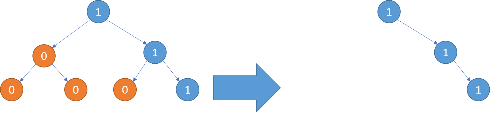

给你二叉树的根结点 `root`，此外树的每个结点的值要么是 `0`，要么是 `1`。

返回移除了所有不包含 `1` 的子树的原二叉树。

节点 `node` 的子树为 `node` 本身加上所有 `node` 的后代。

示例 2：



```C++
输入：root = [1,0,1,0,0,0,1]
输出：[1,null,1,null,1]
```

思路：先递归到最深处，从后往前遍历，遇到0就剪枝，遇到1就保留，边遍历边剪，剪枝的时候需要保证该节点左右节点都为空（叶子节点）

```C++
class Solution {
public:
    TreeNode* pruneTree(TreeNode* root)
    {
        //递归出口
        if(root == nullptr)
        return nullptr;
        //递归到最深处
        root->left = pruneTree(root->left);
        root->right = pruneTree(root->right);
        //判断是否为0，是否符合剪枝条件
        if(root->val == 0 && root->left == nullptr && root->right == nullptr)
        //剪枝回溯
        return nullptr;
        //否则正常回溯
        return root;
    }
};
```
