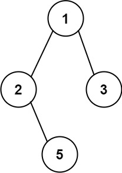
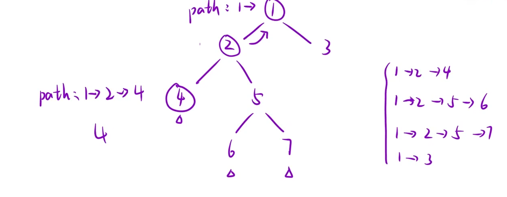

给你一个二叉树的根节点 `root`。

按 任意顺序，返回所有 从根节点到叶子节点 的路径。

叶子节点 是指没有子节点的节点。

示例 1：



```C++
输入：root = [1,2,3,null,5]
输出：["1->2->5","1->3"]
```

思路：如下图所示，这里的path是所有节点共享的，当4向上“恢复现场”时，需要把4删除，这个操作只需要`pop_back`一个数，但是如果是从2恢复到1，那就需要删除`→`和`2`，这样操作就比较麻烦了，所以要利用函数的传值引用特性:让path在每一层都是独立的，不共享的，也就是`dfs(root,path)`,再利用`sting s`，遍历一遍`path`的数字，分情况是不是第一个数来决定`s`中的`→`如何插入将`path`中的数字与`→`拼接，最终`s`得到的结果就是完全体，再将其`push_back`到`ret`中就行



```C++
class Solution {
public:
    vector<string> binaryTreePaths(TreeNode* root)
    {
        vector<string> ret;//用于存放结果
        vector<int> path;//记录路径中的数字，最后借助一个string将->衔接进去
        dfs(root,path,ret);
        return ret;
    }
     void dfs(TreeNode* root, vector<int> path, vector<string>& ret)
     {
        if(root == nullptr) return;
       //记录递归过程经过路径的节点
        path.push_back(root->val);
        //若是叶子节点 就可以开始拼接"->"
        if(root->left == nullptr && root->right == nullptr)
        {
            string s;
            for(int i = 0;i<path.size();i++)
            {
                //如果不是path的第一个数，直接拼接到->后面
                if(i > 0)  s += "->";
                s += to_string(path[i]);
            }
            ret.push_back(s);
        }
        else
        {
            dfs(root->left,path,ret);
            dfs(root->right,path,ret);
        }
     }
};
```
