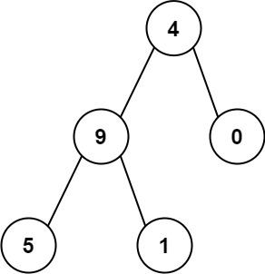

给你一个二叉树的根节点 `root`，树中每个节点都存放有一个 `0` 到 `9` 之间的数字。

每条从根节点到叶节点的路径都代表一个数字：

- 例如，从根节点到叶节点的路径 `1 -> 2 -> 3` 表示数字 `123`。

计算从根节点到叶节点生成的 所有数字之和。

叶节点 是指没有子节点的节点。

示例 2：



```C++
输入：root = [4,9,0,5,1]
输出：1026
解释：
从根到叶子节点路径 4->9->5 代表数字 495
从根到叶子节点路径 4->9->1 代表数字 491
从根到叶子节点路径 4->0 代表数字 40
因此，数字总和 = 495 + 491 + 40 = 1026
```

思路：递归`root→left` 和 `root→right`,并且执行向上+=操作，注意是直接加到位上，而不是单纯的数值相加，所以要*10

```C++
class Solution {
public:
    int sumNumbers(TreeNode* root)
    {
        if(root == nullptr)
        return 0;
        if(root->left == nullptr && root->right == nullptr)
        return root->val;
        if(root->left != nullptr)
        root->left->val += root->val*10;
        if(root->right != nullptr)
        root->right->val += root->val*10;
        int left = sumNumbers(root->left);
        int right = sumNumbers(root->right);
        return left + right;
    }
};
```
