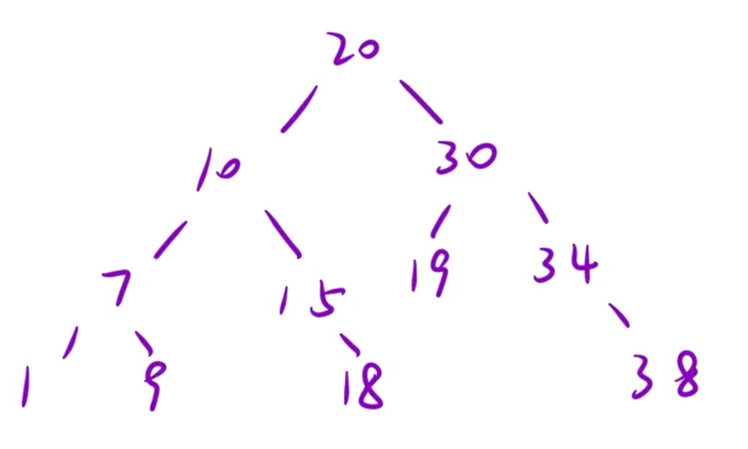

给你一个二叉树的根节点 `root`，判断其是否是一个有效的二叉搜索树。

有效 二叉搜索树定义如下：

- 节点的左子树只包含 严格小于 当前节点的数。

- 节点的右子树只包含 严格大于 当前节点的数。

- 所有左子树和右子树自身必须也是二叉搜索树。

示例 2：


```C++
输入：root = [5,1,4,null,null,3,6]
输出：false
解释：根节点的值是 5 ，但是右子节点的值是 4
```

思路：二叉搜索树的中序遍历是一个有序数组，所以可以用一个全局变量来记录符合题目要求的数

这里定义一个全局变量为`prev`，首先prev指向1做中序遍历`1→7→9→10→15→18→20`符合要求，再中序遍历20的右子树，`20→19→30→38→34`



```C++
class Solution {
    long prev = LONG_MIN;
public:
    bool isValidBST(TreeNode* root)
    {
        if(root == nullptr) return true;
        bool left = isValidBST(root->left);
        bool cur = true;
        if(root->val > prev)
        {
          cur = true;
          prev = root->val;
        }
        else
        cur = false;
        return isValidBST(root->right) && left && cur;//isValidBST(root->right)执行的时候直接到当前子树的右子树，prev此时在“中点”
    }
};
```

[BST校验-执行过程动画.html](images/BST校验-执行过程动画.html)

## 剪枝写法（更简洁）

```C++
class Solution {
    long prev = LONG_MIN;
public:
    bool isValidBST(TreeNode* root)
    {
        if(root == nullptr) return true;
        if(!isValidBST(root->left)) return false;
        if(root->val <= prev) return false;
        prev = root->val;
        return isValidBST(root->right);
    }
};
```
