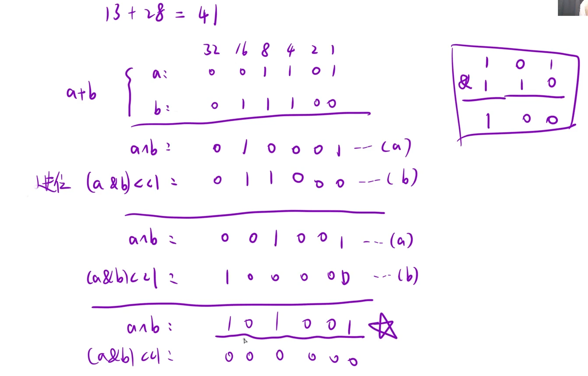

给你两个整数 `a` 和 `b` ，不使用 运算符 `+` 和 `-` ​​​​​​​，计算并返回两整数之和。

### 思路：用异或操作实现加法，异或操作本质无进位相加，只需要把无进位中的"进位"加回去即可。直到"进位"为0终止。只有当a和b那一位上都是1，才存在进位，并且进位是往前+1，所以对应处理应该是`(a & b) <<1`



具体代码过程：要实现a+b就是a^b再恢复进位的相加，让原来的a^b再次异或a^b的进位数，也就是异或上`(a&b) <<1`,不断循环直到`(a&b) <<1 == 0`

```C++
class Solution {
public:
    int getSum(int a, int b) 
    {
        while(b != 0)
        {
            int carry = (a&b) << 1;//算出进位
            a = a ^ b;//算出无进位相加的结果
            b = carry;//更新进位
        }    
        return a;
    }
};
```
