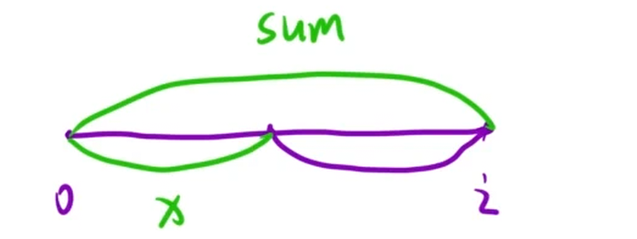

给定一个整数数组 `nums` 和一个整数 `k` ，返回其中元素之和可被 `k` 整除的非空 **子数组** 的数目。

**子数组** 是数组中 **连续** 的部分。

**示例 1：**

```C++
输入：nums = [4,5,0,-2,-3,1], k = 5
输出：7
解释：
有 7 个子数组满足其元素之和可被 k = 5 整除：
[4, 5, 0, -2, -3, 1], [5], [5, 0], [5, 0, -2, -3], [0], [0, -2, -3], [-2, -3]
```

**示例 2:**

```C++
输入: nums = [5], k = 9
输出: 0
```

思路：引入同余定理：(a-b)/p被整除，那么`a%p = b%p`

对于负数%正数，c++的处理：正常都是正数的话就是a%p，若**可能有**负数则是`(a%p+p)%p`,再%p是兼顾正数的情况，p%p不会造成影响

具体代码的处理如下图，将数组分为两个区间，分别是x和sum-k，利用**前缀和**思想将问题转化为**子数组和 = 两个前缀和的差。这样预处理出一个前缀和，可以让复杂度从n^2降为n**

能被 k 整除 ⇔ (sum - x) % k == 0
等价 ⇔ sum % k == x % k

**要找的是，在当前位置 **`i`** 之前，有多少个前缀和的余数等于当前前缀和的余数。**

### 为什么需要找这个？

子数组 `[j, i]` 的和能被 `k` 整除的条件是：

```C++
(sum[i] - sum[j-1]) % k == 0
```

等价于：

```C++
sum[i] % k == sum[j-1] % k
```

`sum[i]` 是当前位置的前缀和，`sum[j-1]` 是之前某个位置的前缀和。
所以，**在当前位置 **`i`** 之前，有多少个前缀和的余数等于当前前缀和的余数，就有多少个以 **`i`** 结尾的合法子数组。**



```C++
class Solution {
public:
    int subarraysDivByK(vector<int>& nums, int k) 
    {
        int n = nums.size();
        unordered_map<int,int> hash;   
        int sum = 0,ans = 0;
        hash[0] = 1;
        for(auto num : nums)
        {
            sum += num; 
            int mod = (sum % k + k) % k;   // 当前前缀和也就是x在遍历过程中和的余数，类似dp[i] % k
            if(hash.count(mod))    //若找到相同的余数->对应sum[i] % k == sum[j-1] % k
            ans += hash[mod];   //加上之前相同余数的出现次数
            hash[mod]++;      //让当前余数 mod 在哈希表中的记录次数 +1
        }
        return ans;
    }
};
```

以`nums = [4, 5, 0, -2, -3, 1]`, `k = 5`举例

## 结论

### **在当前位置 **`i`** 之前，有多少个前缀和的余数等于当前前缀和的余数，就有多少个以 **`i`** 结尾的合法子数组。**

---

### 应用

| 位置 i | 元素 | 当前前缀和 sum | 当前余数 mod | 之前相同余数的数量 | 新增合法子数组数 | 对应的子数组 |
| --- | --- | --- | --- | --- | --- | --- |
| 0 | 4 | 4 | 4 | 0 | 0 | 无 |
| 1 | 5 | 9 | 4 | 1 | 1 | [5] |
| 2 | 0 | 9 | 4 | 2 | 2 | [0], [5,0] |
| 3 | -2 | 7 | 2 | 0 | 0 | 无 |
| 4 | -3 | 4 | 4 | 3 | 3 | [5,0,-2,-3], [0,-2,-3], [-2,-3] |
| 5 | 1 | 5 | 0 | 1 | 1 | [4,5,0,-2,-3,1] |

---

### 验证

| 当前位置 | 新增合法子数组 | 子数组和 | 能否被 5 整除 |
| --- | --- | --- | --- |
| 1 | [5] | 5 | ✅可以 |
| 2 | [0], [5,0] | 0, 5 | ✅可以 |
| 4 | [5,0,-2,-3], [0,-2,-3], [-2,-3] | 0, -5, -5 | ✅可以 |
| 5 | [4,5,0,-2,-3,1] | 5 | ✅可以 |

总数 `= 1 + 2 + 3 + 1 = 7` ✅

### 为什么需要 `hash[0] = 1`？

`hash[0]` 表示"空前缀和"的余数出现了 1 次。位置在数组开头之前，前缀和为 0，余数为 0。

当遍历到某个位置时，如果当前前缀和能被 `k` 整除，`mod = 0`，`hash[0] = 1` 会让 `ans += 1`，统计到从开头到当前位置的整个子数组。

---

### 示例

`nums = [5]`, `k = 5`

| 步骤 | sum | mod | hash[0] | ans |
| --- | --- | --- | --- | --- |
| 初始 | — | — | 1 | 0 |
| 遍历 | 5 | 0 | 1 | ans += 1 → 1 |

没有 `hash[0] = 1`，这个子数组就统计不到。

---

`hash[0] = 1` 就是"空前缀和"，让从开头开始的子数组也能被正常统计。

## sum与x的关系

### 区别

| 概念 | 含义 | 代码中的体现 |
| --- | --- | --- |
| sum | 当前位置的前缀和 | sum += num 不断更新 |
| x | 之前某个位置的前缀和 | 存在哈希表里，不再变化 |

`sum` 是变量，每次循环更新；`x` 是历史值，存储后就不再改变。

---

### 示例

`nums = [4, 5, 0]`

| 位置 | sum（当前值） | 存入哈希表的 x（历史值） |
| --- | --- | --- |
| 0 | 4 | 4 |
| 1 | 9 | 4, 9 |
| 2 | 9 | 4, 9, 9 |

`sum` 不断变化，`x` 是已经过去的 `sum`。
