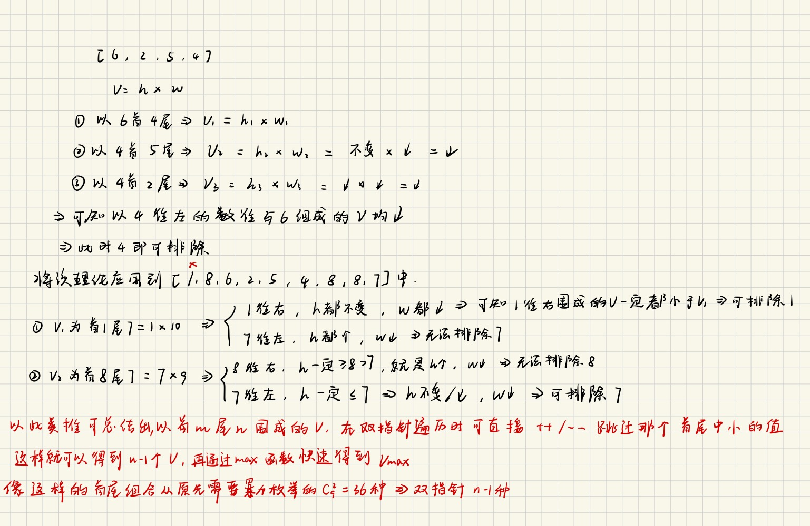

给定一个长度为 `n` 的整数数组 `height` 。有 `n` 条垂线，第 `i` 条线的两个端点是 `(i, 0)` 和 `(i, height[i])` 。

找出其中的两条线，使得它们与 `x` 轴共同构成的容器可以容纳最多的水。

返回容器可以储存的最大水量。

**说明：**你不能倾斜容器。

**示例 1：**


```C++
输入：[1,8,6,2,5,4,8,3,7]
输出：49 
解释：图中垂直线代表输入数组 [1,8,6,2,5,4,8,3,7]。在此情况下，容器能够容纳水（表示为蓝色部分）的最大值为 49。
```

**示例 2：**

```C++
输入：height = [1,1]
输出：1
```

思路如下图



```C++
class Solution {
public:
    int maxArea(vector<int>& height) 
    {
        int left = 0,right = height.size()-1,res = 0;
        while(left < right)
        {
            int v = min(height[left],height[right]) * (right - left);
            res = max(res,v);
            if(height[left] < height[right])
            left++;
            else
            right--;
        }
        return res;
    }
};
```

另外提供一种暴力的方法，虽然过不了leetcode，但是还是可以锻炼一下思维的~

```C++
class Solution {
public:
    int maxArea(vector<int>& height) {
        int n = height.size();
        int ans = 0;

        for (int i = 0; i < n; i++) {
            for (int j = i + 1; j < n; j++) {
                int h = min(height[i], height[j]);
                int w = j - i;
                ans = max(ans, h * w);
            }
        }

        return ans;
    }
};
```