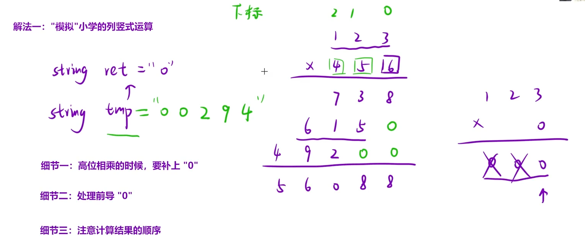
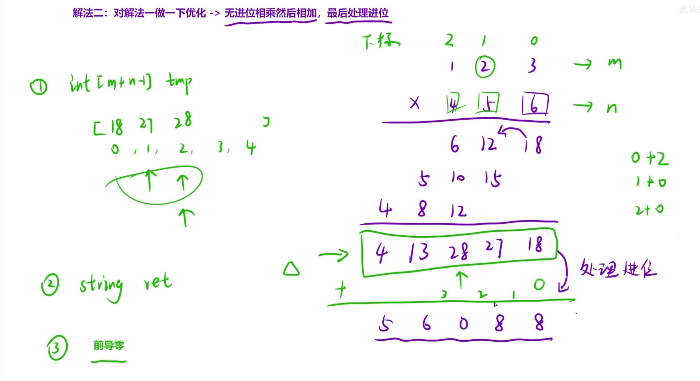

给定两个以字符串形式表示的非负整数 `num1` 和 `num2`，返回 `num1` 和 `num2` 的乘积，它们的乘积也表示为字符串形式。

注意：不能使用任何内置的 BigInteger 库或直接将输入转换为整数。

示例 1:

```C++
输入: num1 = "2", num2 = "3"
输出: "6"
```

示例 2:

```C++
输入: num1 = "123", num2 = "456"
输出: "56088"
```

解法一：模拟小学的列竖式计算



### 细节一：高位相乘要补 "0"

为什么？

- `123 × 5` 的结果是 `615`，末尾对齐个位。

- `123 × 4` 的结果是 `492`，但 `4` 在十位，所以实际是 `4920`。

所以在代码里：每算完一轮乘法，要在 `tmp` 末尾补 `0`，补的数量 = 当前处理的位数（从低位往高位走，第 0 轮补 0 个，第 1 轮补 1 个，第 2 轮补 2 个……）。

### 细节二：处理前导 "0"

为什么？

- `tmp` 可能是 `"00294"` 这种形式（图里写的）。

- 如果不处理，累加时会有前导零，最终结果可能变成 `"056085"` 而不是 `"56085"`。

所以在代码里：每轮乘完后，要去掉 `tmp` 的前导零，再进行累加。

### 细节三：注意计算结果的顺序

为什么？

- 乘法是从低位往高位算的，所以 `tmp` 里的结果是低位在前。

- 但 `ret` 累加时，需要高位在前。

所以在代码里：要么每轮都反转 `tmp`，要么最后统一反转 `ret`。图里最后的结果 `56085` 就是从低位算完再反转得到的。

```C++
class Solution {
public:
    string multiply(string num1, string num2) {
        if (num1 == "0" || num2 == "0") return "0";

        string ret = "0";
        int n1 = num1.size(), n2 = num2.size();

        for (int i = n2 - 1; i >= 0; i--) {
            string tmp;
            int carry = 0;
            int b = num2[i] - '0';

            // 逐位相乘，tmp 高位在前
            for (int j = n1 - 1; j >= 0; j--) {
                int a = num1[j] - '0';
                int sum = a * b + carry;
                tmp = char(sum % 10 + '0') + tmp;   // 头插，高位在前
                carry = sum / 10;
            }
            if (carry) tmp = char(carry + '0') + tmp;

            // 补 0：加在末尾（低位）
            for (int k = 0; k < n2 - 1 - i; k++) {
                tmp += '0';
            }

            // 去前导 0：删头部（高位）
            while (tmp.size() > 1 && tmp[0] == '0') {
                tmp.erase(tmp.begin());
            }

            ret = addStrings(ret, tmp);
        }

        return ret;
    }

    // 字符串加法，高位在前
    string addStrings(string a, string b) {
        string res;
        int i = a.size() - 1, j = b.size() - 1, carry = 0;
        while (i >= 0 || j >= 0 || carry) {
            int sum = carry;
            if (i >= 0) sum += a[i--] - '0';
            if (j >= 0) sum += b[j--] - '0';
            res = char(sum % 10 + '0') + res;   // 头插，高位在前
            carry = sum / 10;
        }
        return res;
    }
};
```

解法二：在解法一的基础上优化，改为无进位相乘再相加，最后再处理进位



观察规律：创建一个大小为`n1 + n2 - 1` 的数组，以这里`123 x 456`举例，如何知道两个数相乘后应该放到数组中的哪个位置？通过观察可知 只需要让两个下标相加就是最终要放入数组的位置了

完成数组的填入后，再建立一个`string ret`进行进位操作，相当于`+0`，转换为两数相加的过程。

```C++
class Solution {
public:
    string multiply(string n1, string n2)
    {
        //1.前置工作 创立好大小为m+n-1的数组
        int m = n1.size(),n = n2.size();
        reverse(n1.begin(),n1.end());
        reverse(n2.begin(),n2.end());
        vector<int> tmp(m+n-1);
        //2.无进位相乘再相加
        for(int i = 0;i<m;i++)
        for(int j = 0;j<n;j++)
        tmp[i+j] += (n1[i] - '0') * (n2[j] - '0');
        //3.处理进位(字符串相加)
        string res;
        int cur = 0,t = 0;
        while(cur < m+n-1 || t)
        {
            int sum = t;//当前位总和
            if(cur < m+n-1) sum += tmp[cur++];
            res +=  sum % 10 + '0';
            t = sum / 10;
        }
        //4.处理前导零
        while(res.size() > 1 && res.back() == '0')
        res.pop_back();
        reverse(res.begin(),res.end());
        return res;
    }
};
```
