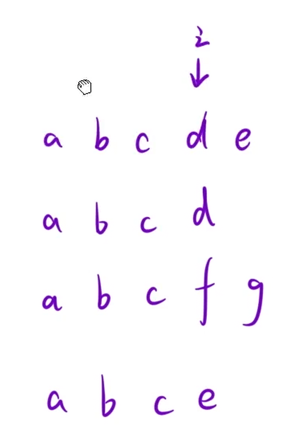

编写一个函数来查找字符串数组中的最长公共前缀。

如果不存在公共前缀，返回空字符串 `""`。

示例 1：

```C++
输入：strs = ["flower","flow","flight"]
输出："fl"
```

思路：整体竖行比较，只要有不一样就终止先看第一个字符串的第 `i` 个字符，然后检查所有字符串的第 `i` 个字符是否相同。



```C++
class Solution {
public:
    string longestCommonPrefix(vector<string>& strs) 
    {
        for(int i = 0;i<strs[0].size();i++)
        {
            char tmp = strs[0][i];
            for(int j = 1;j<strs.size();j++)
            {
                if(i == strs[j].size() || tmp != strs[j][i])
                return strs[0].substr(0,i);
            }
        }
        return strs[0];
    }
};
```
