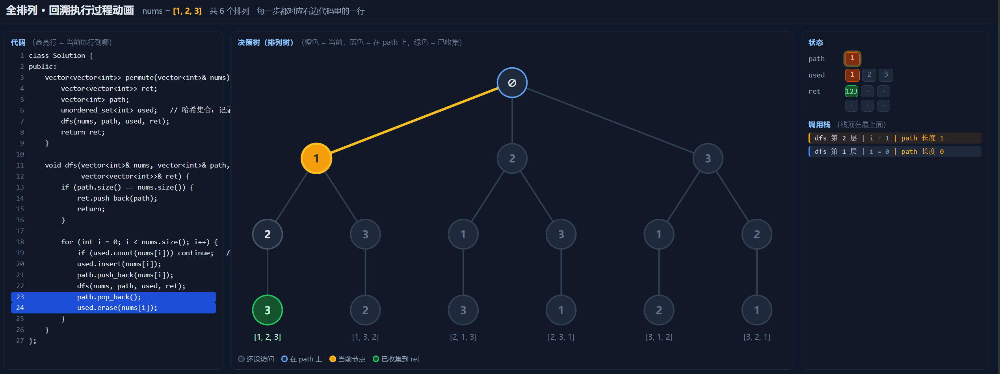
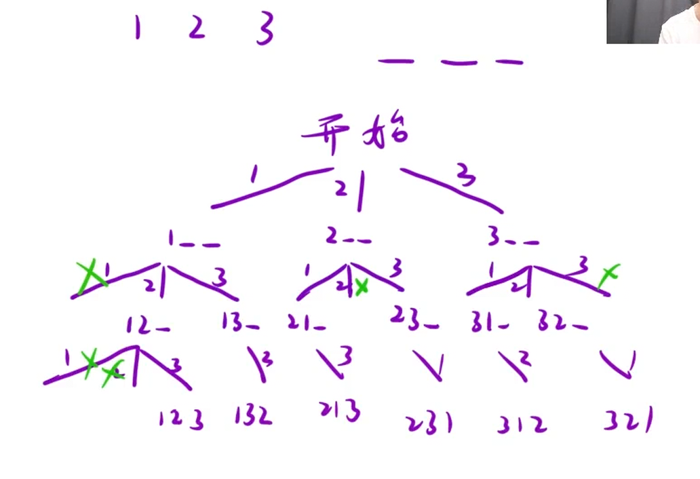

给定一个不含重复数字的数组 `nums`，返回其 *所有可能的全排列*。你可以 按任意顺序 返回答案。

示例 1：

```C++
输入：nums = [1,2,3]
输出：[[1,2,3],[1,3,2],[2,1,3],[2,3,1],[3,1,2],[3,2,1]]
```

### 思路：

如下图所示画出决策树，明确干了什么事情：从`nums`数组中选数组全排列，每一个节点都有三种选择，要通过剪枝选出符合条件的，再利用递归只需关注某一节点在干什么就可以让其可以一直延续

每一个节点都在：

记录路径，通过for循环结合递归和哈希表集中控制某一个大节点当前这一“深搜”竖列，实现一个大节点中枚举所有可能的选择，当枚举完一深搜竖列之后通过递归回溯将其回到上一个分支前的大节点，也就是从1→2→3后，通过

```C++
  path.pop_back();                      // 回溯
  used.erase(nums[i]);
```

重新回溯到1这个大节点以此往复递归 循环 就可以解决每一“深搜竖列”了。



### 细节问题：

1.将路径用过的数记录到哈希表，回溯的同时删除哈希表的数

2.如果这个数在哈希表中能查到那就剪枝，利用continue进入下一次循环，造成的结果就是从下图精简到上图



总结：`for` 管“横向枚举”，`dfs` 管“纵向深入”，`pop_back` + `erase` 管“回溯撤销”。

```C++
class Solution {
public:
    vector<vector<int>> permute(vector<int>& nums)
    {
        vector<vector<int>> ret;
        vector<int> path;
        unordered_set<int> hash;
        dfs(nums,path,ret,hash);
        return ret;
    }
    void dfs(vector<int>& nums,vector<int>& path,vector<vector<int>>& ret,unordered_set<int>& hash)
    {
        //递归出口
        if(path.size() == nums.size())
        {
            ret.push_back(path);
            return;
        }
        //循环控制横向枚举 + 递归控制纵向深入
        for(int i = 0;i<nums.size();i++)
        {
            //如果哈希表中已存在 那就剪枝
            if(hash.count(nums[i])) continue;
            //否则将其加入到路径与哈希表中
            path.push_back(nums[i]);
            hash.insert(nums[i]);
            dfs(nums,path,ret,hash);
            //回溯
            path.pop_back();
            hash.erase(nums[i]);
        }
    }
};
```
