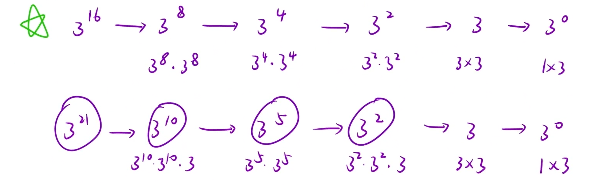

实现 [pow(](https://www.cplusplus.com/reference/valarray/pow/)*[x](https://www.cplusplus.com/reference/valarray/pow/)*[, ](https://www.cplusplus.com/reference/valarray/pow/)*[n](https://www.cplusplus.com/reference/valarray/pow/)*[)](https://www.cplusplus.com/reference/valarray/pow/)，即计算 `x` 的整数 `n` 次幂函数（即，`xn`）。

示例 1：

```C++
输入：x = 2.00000, n = 10
输出：1024.00000
```



思路：

1.相同子问题→设计函数头→`int pow(x,n)`

2.每一个子问题在干嘛→设计函数体→`tmp = pow(x,n/2)` 再分情况讨论

`return n%2 == 0 ? tmp*tmp : tmp * tmp * x`

3.递归出口

n == 0 `return 1;`

4.细节问题

当n为负数要转化

数据可能溢出要用 `longlong` 类型

```C++
class Solution {
public:
    double myPow(double x, int n)
    {
        long long N = n;
        if(N < 0)
        {
            N = -N;
            x = 1/x;
        }
        return pow(x,N);
    }
    //设计函数头
    double pow(double x , long long n)
    {
        if(n == 0)
        return 1;
        //设计函数体：每一个子问题在干嘛
        double tmp = pow(x,n/2);
        return n % 2 == 0 ? tmp * tmp : tmp * tmp * x;
    }
};
```
