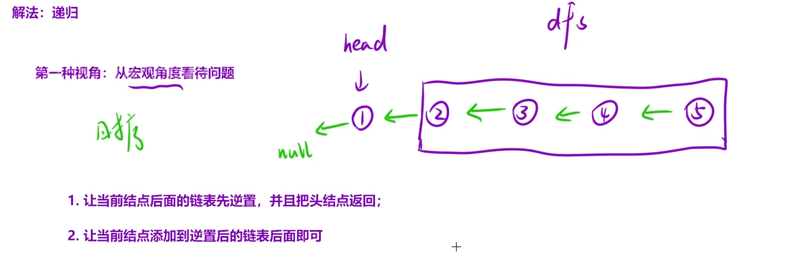

给定单链表的头节点 `head`，请反转链表，并返回反转后的链表的头节点。

示例 1：


```C++
输入：head = [1,2,3,4,5]
输出：[5,4,3,2,1]
```

思路：如果先将1，2逆序，那3就会丢失，所以从后面开始逆序，也就是将2,3,4,5全部逆序，再将2接到1，递归思路：让head一直向下递归至5就停止，然后执行返回操作，让指针倒转，也就是原本4→5要变为4←5，同时要把4置空，不然会成环



```C++
class Solution {
public:
    ListNode* reverseList(ListNode* head)
    {
        if(head == nullptr || head->next == nullptr)
        return head;
        //先递归到最后一个节点，newHead 就是反转后的新头
        ListNode* newhead = reverseList(head->next);
        //逆转箭头
        head->next->next = head;
        //断开此时head的next，避免成环
        head->next = nullptr;
        return newhead;
    }
};
```

### 递归的过程就相当于循环遍历找到尾节点，作为新的头节点。
