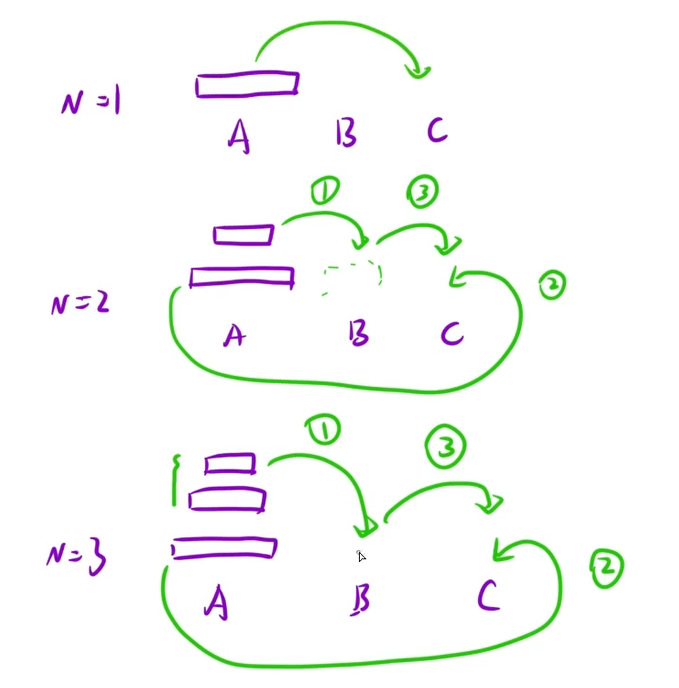

在经典汉诺塔问题中，有 3 根柱子及 N 个不同大小的穿孔圆盘，盘子可以滑入任意一根柱子。一开始，所有盘子自上而下按升序依次套在第一根柱子上(即每一个盘子只能放在更大的盘子上面)。移动圆盘时受到以下限制:
(1) 每次只能移动一个盘子;
(2) 盘子只能从柱子顶端滑出移到下一根柱子;
(3) 盘子只能叠在比它大的盘子上。

请编写程序，用栈将所有盘子从第一根柱子移到最后一根柱子。

你需要原地修改栈。

示例 1：

```C++
 输入：A = [2, 1, 0], B = [], C = []
 输出：C = [2, 1, 0]
```

思路：如下图，会发现不论N=几过程都是相同的 都是要先把最大的挪到`C`，所以先把最大的上面的所有盘子借助`C`挪到辅助盘`B`，再将最大的挪到`C`，最后再将辅助盘`B`借助`A`叠到`C`上，这几个步骤都是相同的子问题，所以想到用递归。



```C++
class Solution {
public:
    void hanota(vector<int>& A, vector<int>& B, vector<int>& C)
    {
        dfs(A,B,C,A.size());
    }
    void dfs(vector<int>& A, vector<int>& B, vector<int>& C,int n)
    {
        if(n == 1)
        {
        C.push_back(A.back());
        A.pop_back();
        return;
        }
        dfs(A,C,B,n-1);
        C.push_back(A.back());
        A.pop_back();
        dfs(B,A,C,n-1);
    }
};
```
