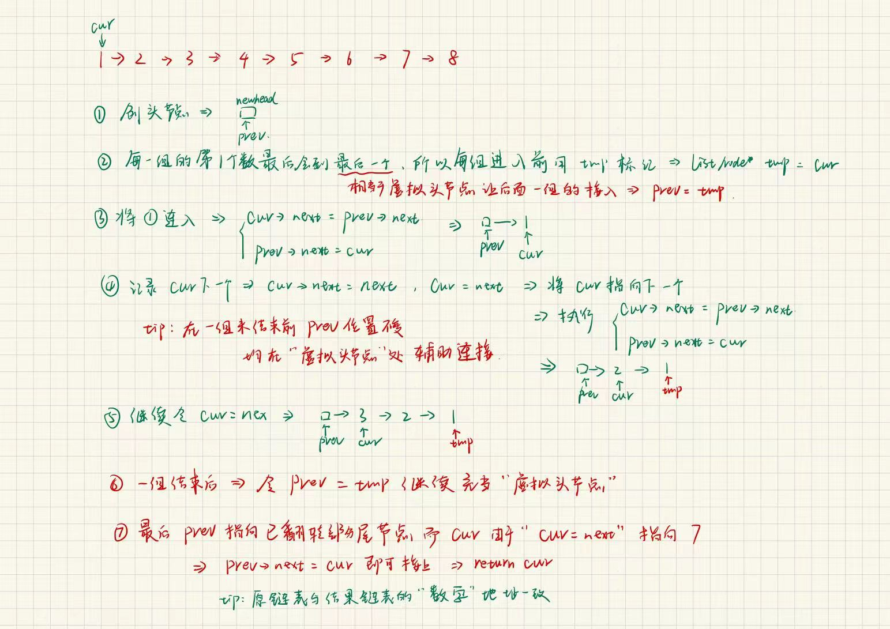

给你链表的头节点 `head`，每 `k` 个节点一组进行翻转，请你返回修改后的链表。

`k` 是一个正整数，它的值小于或等于链表的长度。如果节点总数不是 `k` 的整数倍，那么请将最后剩余的节点保持原有顺序。

你不能只是单纯的改变节点内部的值，而是需要实际进行节点交换。

示例 1：


```C++
输入：head = [1,2,3,4,5], k = 2
输出：[2,1,4,3,5]
```

## 分析过程：



```C++
class Solution {
public:
    ListNode* reverseKGroup(ListNode* head, int k) 
    {
        //先算出需要逆序多少组
        //遍历链表
        ListNode* cur = head;
        int n = 0;
        while(cur)
        {
            cur = cur->next;
            n++;
        }
        n /= k;
        //重复n次，翻转长度为k的链表
        //1.创建虚拟头节点
        ListNode* newhead = new ListNode(0);
        ListNode* prev = newhead;
        cur = head;
        for(int i = 0;i<n;i++)
        {
            //用一个tmp记录每一组开头的位置，因为每一组开头的位置逆序之后就会到最后一个，作为下一组的“虚拟头节点”
            ListNode* tmp = cur;
            for(int j = 0;j<k;j++)
            {
                //2.将虚拟头节点和表头链接
                ListNode* next = cur->next;//存储cur下一位的位置，因为要要从原数组转移至结果数组，可能丢失数据
                cur->next = prev->next;
                prev->next = cur;
                cur = next;
            }
            prev = tmp;//借助前面记录的tmp让prev重新回归“虚拟头节点”的位置
        }
        prev->next = cur;//把剩余部分接上
        cur = newhead->next;//让cur指向真正的头节点
        return cur;
    }
};
```
