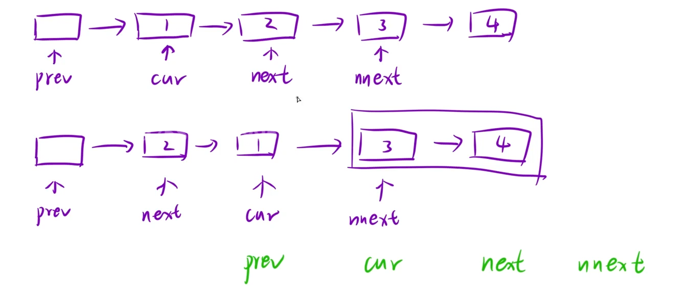

给你一个链表，两两交换其中相邻的节点，并返回交换后链表的头节点。你必须在不修改节点内部的值的情况下完成本题（即，只能进行节点交换）。

示例 1：


```C++
输入：head = [1,2,3,4]
输出：[2,1,4,3]
```

思路：将每组要交换的节点通通标记上，如下图所示



第一组是1和2交换，此时只需让`prev→next = next` , `next→next = cur` , `cur→next = nnext`

接着就是下一组的交换，让`prev = cur`即可继续循环。

循环结束的条件是`while(prev→next && prev→next→next)`,也就是`cur`和`next`但凡有一个为0就终止

当总数为偶数时`cur = 0`，奇数时`next = 0`

```C++
class Solution {
public:
    ListNode* swapPairs(ListNode* head)
    {
        if(head == nullptr || head->next == nullptr)
        return head;
        ListNode* newhead = new ListNode(0);  //创建虚拟头节点
        ListNode* prev = newhead;
        newhead->next = head;
        while(prev->next && prev->next->next)
        {
            ListNode* cur = prev->next ,*next = cur->next,*nnext = next->next;
            prev->next = next;
            next->next = cur;
            cur->next = nnext;
            prev = cur;
        }
        return newhead->next;
    }
};
```
